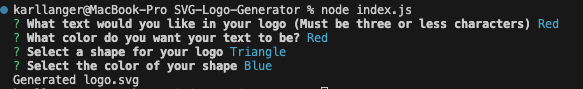
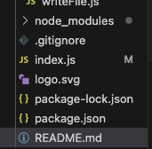

# SVG-Logo-Generator

## Description

This project was made as a part of the Adelaide University Web Development Bootcamp. This project aims to provide a backend application which can be used to generate a simple three letter logo from command line prompts. The user can run this program from their command line, answer the questions presented to them and be provided with a .SVG file with their generated logo. 

During this project I was able to implement the important concepts of Object Oriented Programming and Test Driven Devlopment. A series of tests were written using Jest prior to adding functionality to the application, allowing for a test driven environment. Modules, constructors and classes have been adopted throughout this challenge to demonstrate understanding of Object Oriented Programming. 

View a video of how to run tests and how to produce a logo here:

https://drive.google.com/file/d/131d4R7jcZTYzbuBx9TnlsHvYwoA0e3rx/view?usp=sharing
 
## Installation
In order to run this application you will need to clone the repository to your local computer. The application can then be accessed from the command line by runnning "node index.js"

## Usage
Once you have cloned this repository to your local computer you can run the program with "node index.js"
You will then be presented with four questions allowing you to input the text, select a shape and decide on the colours for both of these factors.

After providing your answers simply press enter and your generated SVG image titled "logo.svg" will be added to the same folder.

Here is an example of a generated logo:

## Tests
 
This application tests each shapes individual class for the following:
- Is an instance of the Object created 
- Will a selected color successfully be saved on the object 
- Whether the shape.render() will generate the appropriate XML

To run tests navigate into the respotiory and type 'npm run test' in the terminal. You will then be presented with the test results.
